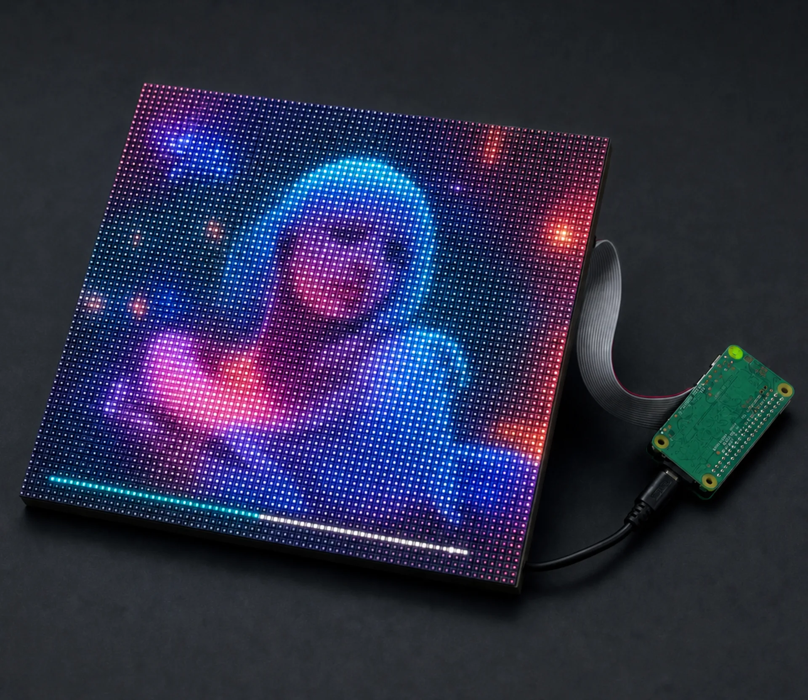
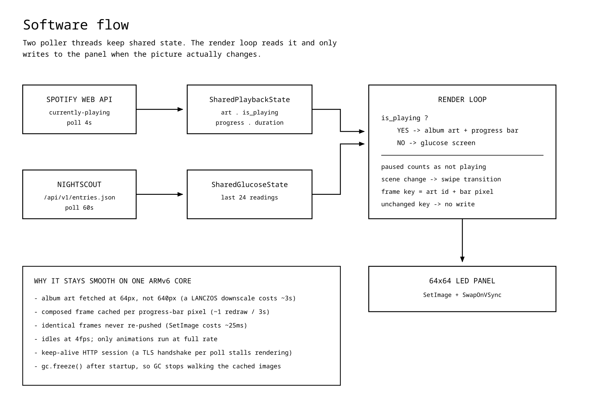
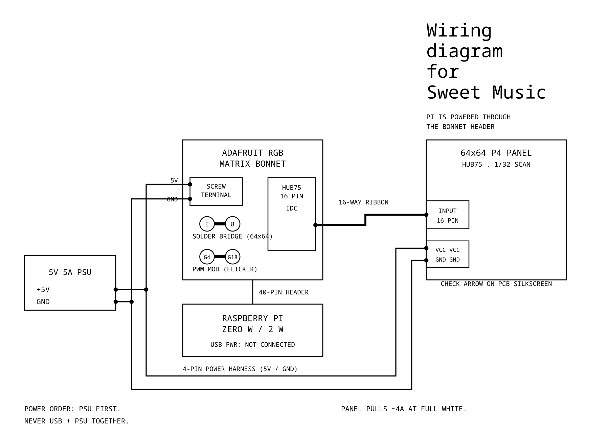
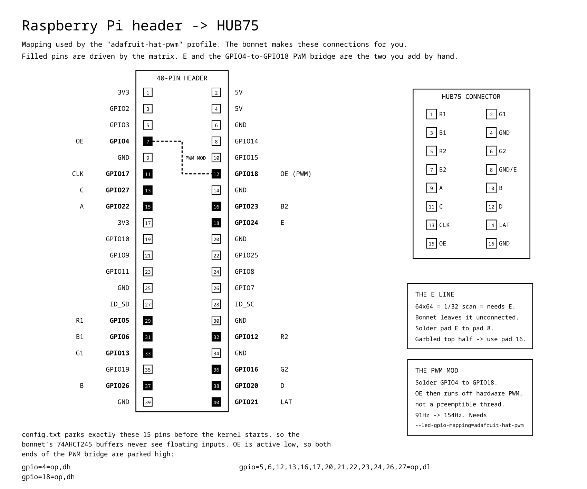

# Sweet Music



A wall-mounted 64×64 LED matrix that shows **Spotify album art with a live progress bar** while music is playing, and falls back to **continuous glucose readings from Nightscout** when it isn't.

Built on a Raspberry Pi Zero W with an Adafruit RGB Matrix Bonnet.



---

## What it does

**While Spotify is playing** — the album cover fills the whole panel, with a thin progress bar along the bottom. The bar's colour is chosen per track to contrast with the artwork (see [Bar colour](#bar-colour)). Track changes animate with a swipe.

**When nothing is playing** — including when playback is merely paused — the panel switches to a glucose card: the current reading in mmol/L, a trend arrow, the delta since the last reading, how old the reading is, and a sparkline of the last couple of hours against the target range. The border and value are colour-coded by range.

Both directions of the switch are animated.

---

## Hardware

| Part | Notes |
|---|---|
| Raspberry Pi Zero W **or Zero 2 W** | The Zero 2 W is strongly recommended — see [Flicker](#flicker) |
| 64×64 P4 HUB75 panel | 1/32 scan, 5 address lines (A–E) |
| Adafruit RGB Matrix Bonnet | Or the HAT; the bonnet is the smaller one |
| 5V 5A power supply | The panel alone can pull ~4A at full white |
| microSD card | 8GB+ |

### Wiring



*Every connection you actually make: PSU into the bonnet's screw terminal, the 4-pin harness out to the panel, the 16-way ribbon into INPUT, the bonnet seated on the Pi's header, and the two solder bridges on the bonnet — E to pad 8, and GPIO4 to GPIO18 for the PWM mod.*

**One supply feeds everything.** The PSU goes into the bonnet's screw terminals, and the bonnet back-feeds the Pi through the GPIO header. **Do not also connect USB power** — two 5V supplies tied together through the header will fight each other and one will collapse, which shows up as the Pi resetting whenever the panel is energised.

Because the Pi is powered through the header, this bypasses its polyfuse. Check polarity at the terminals with a meter before the first power-up.

Both panel cables are needed: the 16-pin HUB75 ribbon into the panel's **INPUT** side, and the separate 4-pin 5V/GND harness. A dark panel looks identical powered or not, so measure rather than assume.

### Pin mapping

The bonnet makes every signal connection for you — this is the reference for what it is doing, and for the two you add yourself.



*Filled pins are driven by the matrix. Taken from the `adafruit-hat-pwm` profile in `lib/hardware-mapping.c`, which is also why the `config.txt` lines above park exactly those 15 pins. The dashed line is the PWM mod: GPIO4 to GPIO18, which is what moves OE onto the hardware PWM peripheral.*

### The E address line

A 64×64 panel at 1/32 scan needs five address lines. The bonnet does not connect **E** by default — bridge the centre `E` pad to the pad marked `8`. If the top half of the panel appears duplicated or garbled, move the bridge to pad `16` instead; a few third-party panels are wired that way.

### The PWM mod

Do this one too. Solder **GPIO4 to GPIO18** and the blanking signal is driven by the Pi's hardware PWM peripheral instead of a preemptible software thread. It is the largest single improvement to flicker available on this hardware — see [Whole-panel flicker](#whole-panel-flicker) for the measurements and the two config changes it needs.

---

## Software setup

### 1. Operating system

Raspberry Pi OS **Lite, 32-bit (armhf)**. On a Pi Zero W the 64-bit image will not boot — it is a single-core ARMv6.

Flash with Raspberry Pi Imager and use its customisation screen to set the hostname, user, SSH key and Wi-Fi. Recent releases use NetworkManager, so the old `wpa_supplicant.conf`-on-the-boot-partition trick no longer works; provisioning goes through `custom.toml` instead, which Imager writes for you.

### 2. `config.txt`

Add to `/boot/firmware/config.txt`:

```ini
# The onboard PWM audio contends with the matrix for the same hardware.
dtparam=audio=off

# Park the HUB75 GPIOs at defined levels from firmware, before the kernel starts.
# Floating inputs make the bonnet's 74AHCT245 level shifters shoot through.
# GPIO4 is OE (active low), held high so panel output stays disabled during boot.
gpio=4=op,dh
gpio=5,6,12,13,16,17,20,21,22,23,24,26,27=op,dl

# OE moves to GPIO18 under the adafruit-hat-pwm mapping. Park it high too.
gpio=18=op,dh
```

### 3. Build the matrix library

```bash
sudo apt-get update
sudo apt-get install -y python3-dev python3-venv cython3 python3-pillow python3-requests git

git clone https://github.com/hzeller/rpi-rgb-led-matrix
cd rpi-rgb-led-matrix
```

Then install the Python bindings **into the project venv** you create in the next step. On a Pi Zero this compile takes roughly ten minutes — run it under `nohup` or `tmux` so an SSH drop doesn't kill it.

### 4. Install Sweet Music

```bash
git clone https://github.com/<you>/sweet-music
cd sweet-music

python3 -m venv .venv --system-site-packages
.venv/bin/pip install python-dotenv

# bindings, built against the clone from step 3
cd ~/rpi-rgb-led-matrix && ~/sweet-music/.venv/bin/pip install . && cd ~/sweet-music
```

`--system-site-packages` matters: it lets Pillow and requests come from the apt packages. Letting pip build Pillow from source on a 512MB Pi Zero tends to run it out of memory.

Copy the fonts the glucose screen uses (they ship with the matrix library, so they are not duplicated here):

```bash
mkdir -p fonts
cp ~/rpi-rgb-led-matrix/fonts/{5x7,9x18B,10x20,texgyre-27}.bdf fonts/
```

### 5. Configure

```bash
cp .env.example .env
chmod 600 .env
```

Fill in:

```ini
SPOTIFY_CLIENT_ID=...
SPOTIFY_CLIENT_SECRET=...
SPOTIFY_REDIRECT_URI=http://127.0.0.1:8888/callback
NIGHTSCOUT_URL=https://your-nightscout-site.example.com
```

Create the Spotify app at [developer.spotify.com/dashboard](https://developer.spotify.com/dashboard) and allowlist that redirect URI **exactly**.

`NIGHTSCOUT_URL` is optional. Without it the glucose screen is skipped entirely and the panel simply idles when nothing is playing.

### 6. Authorise Spotify

The now-playing endpoint needs a user token, so there is a one-time browser step. The Pi has no browser, so forward the callback port from a machine that does:

```bash
# on your laptop
ssh -N -L 8888:127.0.0.1:8888 <user>@<pi-address>
```

Then, on the Pi:

```bash
.venv/bin/python spotify_matrix.py --auth-only --no-browser
```

Open the printed URL in your laptop's browser and approve. The refresh token is cached in `.cache/spotify_token.json` and the browser step never repeats.

### 7. Run it

```bash
sudo -E .venv/bin/python spotify_matrix.py
```

All the tuned defaults are baked in, so no flags are needed. Root is required — the matrix library needs realtime thread priority.

### 8. Install as a service

Edit `systemd/sweet-music.service` so the paths match where you cloned it, then:

```bash
sudo cp systemd/sweet-music.service /etc/systemd/system/
sudo systemctl daemon-reload
sudo systemctl enable --now sweet-music
```

Then keep the journal in RAM. A service logging to disk makes the SD card busy, and SD I/O corrupts rows on the panel — see [Corrupt rows](#corrupt-rows):

```bash
sudo mkdir -p /etc/systemd/journald.conf.d
printf 'Storage=volatile\nRuntimeMaxUse=32M\n' | sudo tee /etc/systemd/journald.conf.d/99-volatile.conf
sudo rm -rf /var/log/journal
sudo systemctl restart systemd-journald
```

Logs then survive only until reboot, which is the right trade for a wall display. Use `journalctl -u sweet-music` as normal.

---

## Useful flags

| Flag | Purpose |
|---|---|
| `--test-pattern` | Moving colour bars, no Spotify involved. Use this first to prove the wiring. |
| `--mock-output FILE --once` | Render a single frame to a PNG with no hardware at all |
| `--preview-frames DIR` | Sample frames, for working on the rendering off-device |
| `--auth-only` | Authorise Spotify and exit |
| `--brightness N` | 0–100, default 100 |
| `--nightscout-url URL` | Overrides `NIGHTSCOUT_URL` |

---

## How it works

### Staying smooth on one core

A Pi Zero W has a single ARMv6 core, and the matrix library already spends most of it generating bit-planes. Everything below exists because the naive version was too slow.

- **Fetch the 64px album image, not the 640px one.** Spotify offers several sizes. Downscaling 640→64 with LANCZOS costs about 3 seconds on this hardware and stalls the panel on every track change; taking the small image drops that to under 0.1s.
- **Cache the composed frame per progress-bar pixel.** The bar only advances a pixel every few seconds, so almost every frame is identical to the one before it.
- **Never re-push an identical frame.** `SetImage` costs ~25ms. The loop compares a frame key and skips the write when nothing changed.
- **Idle at 4fps.** Only animations need the full rate. Spinning at 25fps to re-check an unchanged picture steals the core from the refresh thread, which shows up as flicker.
- **Keep-alive HTTP session.** A fresh TLS handshake every poll is expensive enough on ARMv6 to visibly stall rendering.
- **No per-pixel Python loops.** The gradient scrim behind the progress bar is a cached alpha mask composited in C; as a Python loop it cost ~4s.
- **`gc.freeze()` after startup**, so generational GC stops walking the long-lived cached images.

Benchmark on the Pi with the matrix running and the service stopped — measuring before `RGBMatrix()` is constructed gives numbers roughly 4× too optimistic, and leaving the service running means two processes fight over the GPIO.

## Flicker

There are two separate problems here, and they look different. Diagnose which one you have before changing anything.

### Corrupt rows

Whole horizontal lines flash the wrong colour, at random, mostly on bright content. This is **not** brightness-related and **not** a power problem — it is the refresh thread being preempted mid-frame, so a row latches stale data.

The tell is the Pi's green ACT LED: its default trigger is `mmc0`, so a blink is literally an SD card access. If the LED twitches when the panel glitches, SD I/O is stalling the refresh thread.

The culprit is usually dirty-page writeback. ext4 flushes every 5 seconds by default, so anything logging steadily produces a glitch heartbeat. Keeping the journal in RAM removes the source:

```ini
# /etc/systemd/journald.conf.d/99-volatile.conf
Storage=volatile
RuntimeMaxUse=32M
```

Measured over a 45-second static hold, sampling `/sys/block/mmcblk0/stat`: **9 SD bursts before, 1 after.**

Diagnostics worth running before assuming power is at fault:

| Check | Meaning |
|---|---|
| `vcgencmd get_throttled` | `0x0` means no undervoltage ever, including sticky bits — rules out supply sag |
| Same content at brightness 100 vs 40 | No difference rules out current draw |
| `cat /sys/class/leds/*/trigger` | Confirms the ACT LED is on `mmc0` |
| `/proc/swaps` | Raspberry Pi OS now uses zram; swap is in RAM and never touches the card |

A slower GPIO clock is often suggested for this, but it is the wrong trade here — it lowers the refresh rate, and low refresh is the *other* flicker problem. Measured: `gpio_slowdown` 2 / 3 / 4 gives 91.6 / 84.7 / 81.5Hz. Fix the SD I/O instead and leave the clock fast.

### Whole-panel flicker

If the panel shimmers evenly rather than showing corrupt rows, that is refresh rate. Two things move it, in this order.

#### Do the PWM mod

This is the single biggest win, and it is a solder blob. Bridge **GPIO4 to GPIO18** on the bonnet, then use the `adafruit-hat-pwm` mapping instead of `adafruit-hat`. The blanking signal (OE) is then driven by the Pi's hardware PWM peripheral rather than timed by a userspace thread that the kernel can preempt mid-frame. Faster *and* immune to scheduling jitter.

The mod does nothing unless you also change the mapping — the jumper alone is inert.

It also needs the PWM peripheral free, and the Pi's sound driver claims the same hardware. `dtparam=audio=off` is **not sufficient**, because the vc4 HDMI driver pulls `snd_bcm2835` back in:

```bash
echo 'blacklist snd_bcm2835' | sudo tee /etc/modprobe.d/blacklist-rgb-matrix.conf
sudo reboot
```

If you skip this the library refuses to start and tells you to pass `--led-no-hardware-pulse`, which throws away the entire benefit. Fix the sound module instead.

Add GPIO18 to the parked pins in `config.txt`, since OE lives there now:

```ini
gpio=18=op,dh
```

#### Then tune `pwm_lsb_nanoseconds` — but never on refresh rate alone

This is the knob that matters, and it is a trap. Shortening it raises refresh, but **below about 90ns the library busy-waits between bit-planes instead of sleeping**, and the refresh thread then consumes the entire core. On a single-core Pi that means `sshd` can no longer complete a key exchange and the poller threads never run — the panel sits on the "no data" screen while looking beautifully flicker-free, and the only way back in is to pull the SD card.

So measure refresh **and** the CPU left for everything else. Measured on a Pi Zero W, 64×64, `adafruit-hat-pwm`, `pwm_bits=8`, `gpio_slowdown=1`, service stopped, with a fixed arithmetic workload scored against an idle baseline:

| `pwm_lsb_nanoseconds` | Refresh | CPU left over |
|---|---|---|
| 50 | ~166Hz | **unusable** — locked out |
| 90 | 115.4Hz | 18 % |
| 100 | 109.3Hz | 20 % — **default here** |
| 110 | 104.2Hz | 24 % |
| 130 (library default) | 93.9Hz | 29 % |

`gpio_slowdown=1` is what `rpi-rgb-led-matrix` recommends for a Pi 1 / Zero; the higher values exist for the faster Pi 3 and 4.

**`limit_refresh_rate_hz` does not solve this.** The cap only skips whole frames; the busy-wait happens *inside* each frame. Capping a panel that reaches 109Hz at 130Hz changes nothing at all, measured. Leave it at 0 unless you specifically want a stable rate below what the hardware manages.

`pwm_bits=8` rather than the full 11: under hardware PWM the depth looks nearly free on refresh, but the extra bit-planes are more GPIO work per frame and it was measurably worse for CPU headroom. The cost is 256 levels per channel, so very dim colours quantise and can drift off-hue.

**Measure with the service stopped.** Two processes driving the same GPIO reads as 40Hz instead of 146Hz, which looks like a catastrophic regression that isn't real.

### Recovering a Pi you have locked out

If the panel is up but the machine is unreachable, this is almost certainly the busy-wait above. Two escape hatches exist so it never needs a rebuild:

- **`sweet-music.conf` on the FAT boot partition.** Mounts on any laptop, no login, no ext4 tooling. Raise `pwm_lsb_nanoseconds` and reboot. Recognised keys: `brightness`, `gpio_slowdown`, `pwm_bits`, `pwm_lsb_nanoseconds`, `limit_refresh_rate_hz`, `hardware_mapping`, `fps`, `idle_fps`.
- **`.startup-delay`** next to `spotify_matrix.py`, containing a number of seconds. The panel stays blank that long before the hardware is touched, which guarantees a window to get a shell.

Note that **ping is not a liveness test here**. ICMP is answered in kernel softirq context and stays fast while userspace is completely starved. `ssh` reporting *"Connection timed out during banner exchange"* against an open port 22 is the real signature.

**If that is still not enough, the fix is a Pi Zero 2 W.** It is a drop-in replacement — same form factor, same header, same bonnet, and the same 32-bit image boots on it. Being quad-core, you can hand the refresh thread a dedicated core by appending `isolcpus=3` to `/boot/firmware/cmdline.txt`, which is what `rpi-rgb-led-matrix` recommends. That typically reaches 200Hz+.

Note that a different panel does **not** help. HUB75 panels are passive; the "2800Hz refresh" on a seller's spec sheet is what the panel's driver chips can do when fed by a dedicated controller card. Driven by a bit-banging Pi, the refresh rate is set entirely by the Pi.

## Bar colour

The progress bar picks a hue the artwork doesn't use, rather than a fixed colour.

It builds a saturation-weighted hue histogram over the whole cover (36 bins on a 32×32 downsample), smears each bin into its neighbours so a hue *adjacent* to a heavily used one doesn't count as free, and takes the midpoint of the widest unoccupied arc at full saturation. Near-black, near-white and desaturated pixels are excluded, since they carry no meaningful hue and would otherwise vote for arbitrary ones.

Two fallbacks: greyscale artwork, or artwork that genuinely uses every hue, drops to plain white or black based on backdrop brightness. And if the chosen hue happens to sit at the same brightness as what's behind it — which reads as mush on a 2px bar — it is pushed lighter or darker first.

Costs 1–6ms, once per track.

## Glucose display

Nightscout stores glucose as mg/dL in the `sgv` field regardless of what the web UI displays, so the conversion is **`sgv / 18.0`** for mmol/L.

Thresholds used, in mmol/L: urgent low ≤3.0, low <3.9, target 3.9–10.0, high >10.0, urgent high ≥13.9. A reading older than 15 minutes renders grey with its age in red, because a stale number on a wall display is worse than an obviously absent one.

Text uses BDF bitmap fonts from the matrix library, converted to PIL fonts at runtime. Anti-aliased TrueType is unreadable at this size — glyphs smear across the few pixels available.

---

## Troubleshooting

**Panel dark, but the software is running.** Normal until something is actively clocked in. Run `--test-pattern` to prove the path.

**Pi resets whenever the panel is powered.** Two supplies fighting. Disconnect USB power; the PSU should be the only source.

**Top half duplicated or garbled.** E address line. See [above](#the-e-address-line).

**Service reports `active` but nothing appears.** `Restart=always` hides startup crashes. Check `systemctl show sweet-music -p NRestarts` and the CPU time — a crash-looping service accumulates almost none.

**Nothing on the panel for several minutes after a cold boot.** The first poll waits for the network. Warm restarts take under a minute.

**`ModuleNotFoundError` or `Permission denied` at runtime.** The matrix library drops privileges to the `daemon` user after initialising. If the project lives under a `0700` home directory, it can no longer read its own files. This project sets `drop_privileges = False` for that reason.

**apt hangs then fails with "Network is unreachable".** Some networks advertise IPv6 without a working route. Force IPv4:
```bash
echo 'Acquire::ForceIPv4 "true";' | sudo tee /etc/apt/apt.conf.d/99force-ipv4
```

---

## Credits

Built on [hzeller/rpi-rgb-led-matrix](https://github.com/hzeller/rpi-rgb-led-matrix). The spinning-record renderer that this project started from came from [tnarla/spotify-matrix](https://github.com/tnarla/spotify-matrix).

## Licence

MIT — see [LICENSE](LICENSE).
